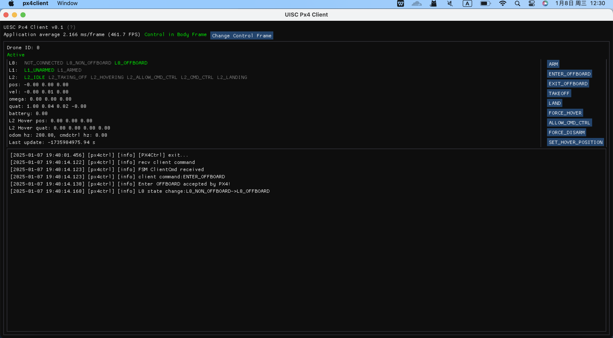

<a id="readme-top"></a>
<br />
<div align="center">
  <a href="https://github.com/Luxru/px4ctrl_client">
    
  </a>

  <h3 align="center">UISC Lab Px4Ctrl Client</h3>

  <p align="center">
    Ground Control Interface for Px4Ctrl
    <br />
    <br />
    
  </p>
</div>

## About

A lightweight UAV ground control station built with **ZeroMQ** and **Dear ImGui**. This client is designed to interface seamlessly with the onboard `px4ctrl` node, providing low-latency control and monitoring capabilities.

**Key Features:**
* **Basic Operations:** Arming, disarming, and hovering control.
* **Setpoint Adjustment:** Real-time modification of hover setpoints.
* **Controller Management:** Dynamic switching between different flight controllers.
* **Swarm Support:** Capabilities for controlling multi-UAV swarms.

## Getting Started

### Prerequisites

Ensure you have the following dependencies installed before building the project:

* **[C++ 20](https://en.cppreference.com/w/cpp/compiler_support)** compliant compiler
* **[spdlog](https://github.com/gabime/spdlog)** (>= v1.14.1)
* **[GLFW](https://github.com/glfw/glfw)** (== 3.4)
* **OpenGL** (>= 3.3)
* **[fmt](https://github.com/fmtlib/fmt)**

### Installation

1.  **Clone the repository:**
    ```bash
    git clone https://github.com/Luxru/px4ctrl_client.git
    cd px4ctrl_client
    ```

2.  **Initialize submodules:**
    ```bash
    git submodule update --init --recursive
    ```

3.  **Build the project:**
    ```bash
    mkdir build && cd build
    cmake ..
    make -j4
    ```

<!-- USAGE EXAMPLES -->
### Usage
Run the client by specifying the ZeroMQ configuration file:

```bash
./px4client -c ../config/zmq.yaml
```



<!-- CONTACT -->
## Contact
Xu Lu - lux@cqu.edu.cn

<!-- ACKNOWLEDGMENTS -->
## Acknowledgments
* [ZJU FastLab](https://github.com/ZJU-FAST-Lab)
* [UZH Robotics and Perception Group](https://github.com/uzh-rpg)
